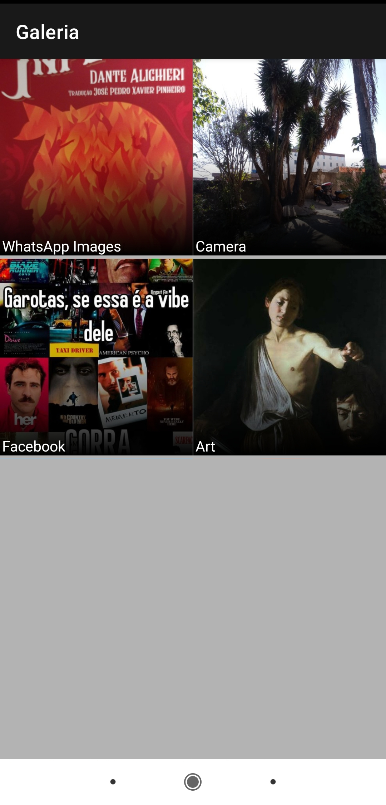
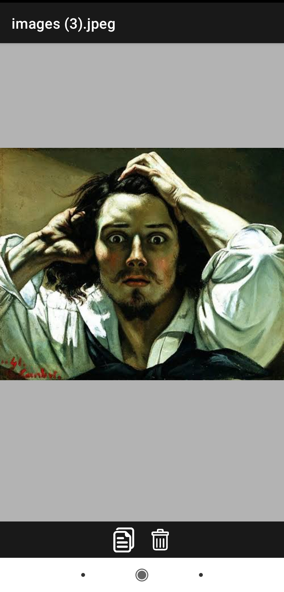

# simple gallery

<a>Uma galeria simples para dispositivos Android. Por enquanto há somente duas funções de gerenciamento (copiar e deletar fotos).</a>

<a>Imagem.1 - Tela inicial com todos os álbuns encontrados no aparelho.</a>  
<a>Imagem.2 - Tela com fotos do álbum selecionado.</a>  
<a>Imagem.3 - Tela com a foto selecionada. Abaixo as opções de copiar e deletar o arquivo.</a>  

  
  
  

